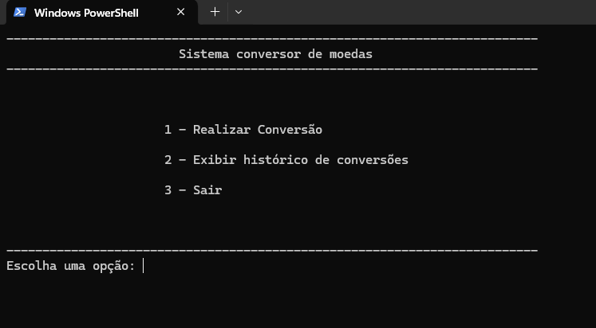
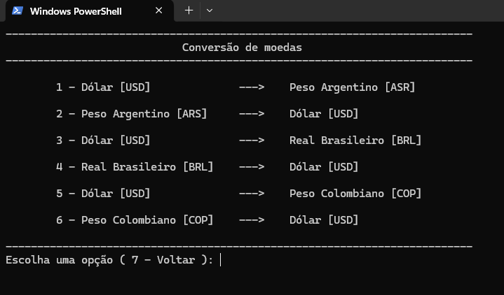
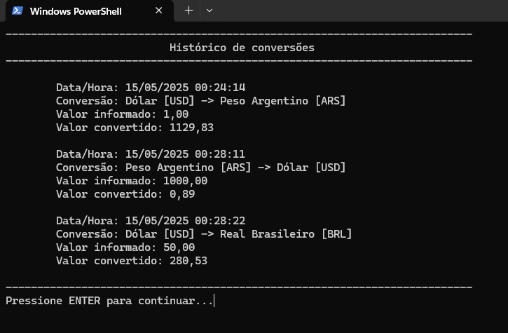

# 💱 Sistema de Conversão de Moedas

Este projeto é um sistema de conversão de moedas desenvolvido em **Java** (modo console), que utiliza uma **API externa** (ExchangeRate API) para obter as taxas de câmbio em **tempo real**. O sistema é interativo, com menu de opções e interface textual amigável, validando entradas do usuário e armazenando o histórico de conversões realizadas.


## Tecnologias e Ferramentas Utilizadas

- **Java 21 (JDK)**
- **Gson** – para manipulação de JSON
- **ExchangeRate API** – para obtenção das taxas de câmbio ([link para a API](https://www.exchangerate-api.com/))
- **Biblioteca auxiliar** – para exibição colorida e limpeza de tela no console
- **IDE: IntelliJ IDEA**


## Funcionalidades

- Menu com 6 opções de conversão
- Entrada de valor a ser convertido com **validação robusta**
- Busca de **cotação em tempo real** usando a ExchangeRate API
- Exibição do resultado com formatação amigável
- Armazenamento do histórico de conversões em `historico.txt`
- Interface com **cores e limpeza de tela** para melhor experiência do usuário


## Como executar o projeto

1. Clone este repositório:
   ```bash
   git clone git@github.com:joseromildogaj/conversor-de-moedas.git
   cd conversor-de-moedas
   ```
2. Construa o projeto
    Main Menu > Build > Build Project

4. Execute o arquivo jar
    ```bash
   cd out/artifacts/ConversorDeMoedas_jar
   java -jar ConversorDeMoedas.jar
   ```
    

## Prints de Telas







